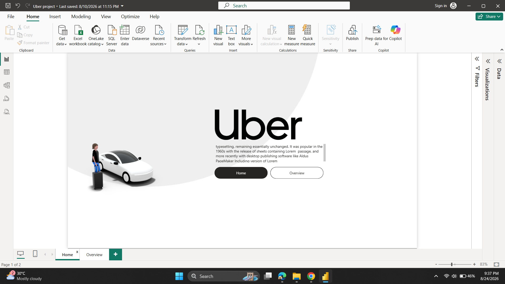
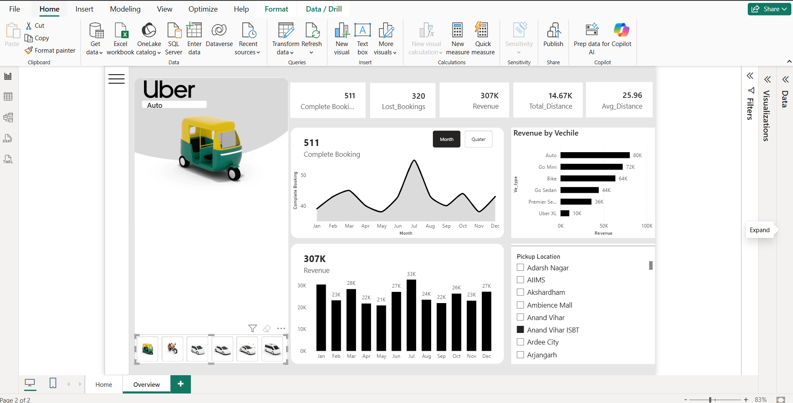

# 🚕 Uber Analytics Dashboard — Power BI

> **An interactive Business Intelligence dashboard built with Microsoft Power BI to analyze Uber booking performance, revenue, vehicle performance, trip distance, booking trends, and operational metrics.**

---

## 📊 Project Overview

The **Uber Analytics Dashboard** is an end-to-end Business Intelligence project designed to transform raw ride-booking data into meaningful and actionable insights.

The dashboard provides a centralized analytical view of:

* 🚕 Booking performance
* 💰 Revenue generation
* 🚗 Vehicle-wise performance
* 📍 Pickup location analysis
* 📏 Trip distance
* 📅 Monthly booking trends
* 📈 Revenue trends
* ❌ Lost / unsuccessful bookings
* 🎯 Key Performance Indicators (KPIs)

The primary objective of this project is to help stakeholders quickly understand **business performance, customer booking behavior, revenue contribution, and operational trends** through an interactive Power BI report.

---

## 🎯 Business Objectives

The dashboard was developed to answer important business questions such as:

1. How many bookings were completed successfully?
2. How many bookings were lost?
3. What is the total revenue generated?
4. Which vehicle categories generate the highest revenue?
5. How does booking performance change throughout the year?
6. Which months generate the highest revenue?
7. What is the average trip distance?
8. How much total distance has been covered?
9. Which pickup locations are being used most frequently?
10. How can booking and revenue trends be monitored interactively?

---

# 🖥️ Dashboard Preview

## 🏠 Home Page

The Home page provides a clean landing interface for navigating through the Power BI report.



---

## 📈 Overview Dashboard

The Overview page provides an analytical view of Uber's booking and revenue performance.



---

# 📌 Key Performance Indicators

The dashboard currently highlights the following KPIs:

| KPI                  |      Value |
| -------------------- | ---------: |
| ✅ Completed Bookings |    **511** |
| ❌ Lost Bookings      |    **320** |
| 💰 Total Revenue     |   **307K** |
| 📏 Total Distance    | **14.67K** |
| 🚗 Average Distance  |  **25.96** |

> KPI values are based on the dataset used in this Power BI report.

---

# 📊 Dashboard Features

## 1. Booking Trend Analysis

A monthly trend visualization is used to understand how completed bookings change throughout the year.

The analysis helps identify:

* Peak booking months
* Low-performing months
* Monthly fluctuations
* Seasonal booking patterns

The dashboard also provides **Month / Quarter** analysis for different time perspectives.

---

## 2. Revenue Analysis

The revenue section provides a monthly breakdown of total revenue.

This allows users to identify:

* Highest revenue-generating months
* Lowest revenue-generating months
* Revenue fluctuations
* Overall revenue performance

### Monthly Revenue

| Month     | Revenue |
| --------- | ------: |
| January   |     30K |
| February  |     23K |
| March     |     28K |
| April     |     22K |
| May       |     21K |
| June      |     27K |
| July      |     33K |
| August    |     24K |
| September |     22K |
| October   |     26K |
| November  |     23K |
| December  |     27K |

> Values are displayed approximately as shown in the dashboard.

---

# 🚘 Revenue by Vehicle Type

The dashboard compares revenue contribution across different vehicle categories.

| Vehicle Type     | Revenue |
| ---------------- | ------: |
| 🚕 Auto          |     80K |
| 🚗 Go Mini       |     72K |
| 🏍️ Bike         |     64K |
| 🚙 Go Sedan      |     44K |
| 🚘 Premier Sedan |     36K |
| 🚘 Uber XL       |     10K |

### Key Observation

**Auto** is the highest revenue-generating vehicle category in the current dashboard, followed by **Go Mini** and **Bike**.

This comparison helps identify which vehicle categories contribute most significantly to overall revenue.

---

# 📍 Pickup Location Analysis

The dashboard includes an interactive pickup-location slicer.

Users can filter the report based on pickup locations such as:

* Adarsh Nagar
* AIIMS
* Akshardham
* Ambience Mall
* Anand Vihar
* Anand Vihar ISBT
* Ardee City
* Arjangarh
* And other available locations

This allows users to perform location-specific analysis without changing the underlying report.

---

# 🧠 Analytical Insights

Based on the current dashboard:

### 💰 Revenue

The dashboard records approximately **307K total revenue**.

### 🚕 Completed Bookings

There are **511 completed bookings** represented in the current report.

### ❌ Lost Bookings

The report shows **320 lost bookings**, providing an important operational metric for understanding booking inefficiencies.

### 🚗 Vehicle Performance

**Auto** contributes the highest revenue among the displayed vehicle categories, while **Uber XL** contributes the lowest.

### 📅 Monthly Performance

July appears as one of the strongest months in the displayed revenue analysis, reaching approximately **33K**.

### 📏 Distance

The report tracks approximately **14.67K total distance**, with an average distance of **25.96**.

---

# 🛠️ Tech Stack

| Technology             | Purpose                                    |
| ---------------------- | ------------------------------------------ |
| **Microsoft Power BI** | Data visualization & dashboard development |
| **Power Query**        | Data cleaning and transformation           |
| **DAX**                | Measures and analytical calculations       |
| **Data Modeling**      | Relationships and analytical structure     |
| **GitHub**             | Project versioning and portfolio hosting   |
| **Power BI Desktop**   | Report development                         |

Power BI supports report creation, data transformation through Power Query, data modeling, interactive filtering, and DAX-based calculations.

---

# 🔄 Data Analytics Workflow

```text
                 RAW DATA
                    │
                    ▼
          ┌──────────────────┐
          │   Data Import    │
          └────────┬─────────┘
                   │
                   ▼
          ┌──────────────────┐
          │  Power Query     │
          │ Cleaning &       │
          │ Transformation   │
          └────────┬─────────┘
                   │
                   ▼
          ┌──────────────────┐
          │   Data Modeling  │
          │ Relationships &  │
          │ Structure        │
          └────────┬─────────┘
                   │
                   ▼
          ┌──────────────────┐
          │       DAX        │
          │ Measures & KPIs  │
          └────────┬─────────┘
                   │
                   ▼
          ┌──────────────────┐
          │ Data Visualization│
          │ Charts / KPIs /  │
          │ Slicers          │
          └────────┬─────────┘
                   │
                   ▼
          ┌──────────────────┐
          │ Interactive      │
          │ Power BI Report  │
          └──────────────────┘
```

---

# 📐 Data Modeling

The Power BI data model was designed to support analytical queries and interactive visualizations.

The modeling process focuses on:

* Appropriate relationships
* Reusable measures
* Analytical dimensions
* KPI calculations
* Filtering behavior
* Report performance

A well-structured model is important because Power BI reports rely on the underlying semantic model to produce interactive analytical results.

---

# 🧮 DAX & Measures

The project uses DAX-based calculations to generate analytical metrics and KPIs.

Typical analytical calculations include:

```DAX
Total Revenue =
SUM(Bookings[Revenue])
```

```DAX
Total Bookings =
COUNTROWS(Bookings)
```

```DAX
Average Distance =
AVERAGE(Bookings[Distance])
```

```DAX
Total Distance =
SUM(Bookings[Distance])
```

> Measure names and formulas may vary depending on the final data model.

DAX is Power BI's expression language for creating calculations from data in the model.

---

# 🎛️ Interactive Features

The report includes interactive functionality such as:

* 📅 Month analysis
* 📊 Quarter analysis
* 📍 Pickup-location filtering
* 🚕 Vehicle-type comparison
* 📈 Dynamic visual interaction
* 🔎 Cross-filtering between visuals
* 📌 KPI cards

These features allow users to explore the data rather than simply viewing static charts.

---

# 🎨 Dashboard Design

The dashboard follows a clean analytical design focused on:

* Minimal visual clutter
* Consistent typography
* KPI-first information hierarchy
* Clear chart labeling
* Interactive filtering
* Business-oriented visualizations
* Simple navigation between report pages

The goal is to make important business metrics understandable at a glance while still allowing deeper exploration.

---

# 📂 Repository Structure

```text
Uber-powerbi-dashboard/
│
├── Uber_PowerBI_Dashboard.pbix
│
├── screenshots/
│   ├── Home.png
│   └── Overview.png
│
└── README.md
```

---

# 🚀 How to Use

### 1. Clone the repository

```bash
git clone https://github.com/prashant23-kr/Uber-powerbi-dashboard.git
```

### 2. Open the project

Open:

```text
Uber_PowerBI_Dashboard.pbix
```

using **Power BI Desktop**.

### 3. Explore the report

Use:

* Slicers
* Filters
* Charts
* KPI cards
* Month / Quarter controls
* Vehicle categories
* Pickup locations

to interact with the dashboard.

---

# ⚠️ Data Disclaimer

This project is created for **educational, portfolio, and data-analytics demonstration purposes**.

The dashboard should not be interpreted as official Uber business intelligence or official Uber financial reporting.

Any dataset used in this project should be treated according to its original licensing and usage terms.

---

# 📚 Skills Demonstrated

This project demonstrates practical experience with:

* ✅ Business Intelligence
* ✅ Data Visualization
* ✅ Power BI
* ✅ Power Query
* ✅ DAX
* ✅ Data Cleaning
* ✅ Data Modeling
* ✅ KPI Development
* ✅ Interactive Dashboard Design
* ✅ Trend Analysis
* ✅ Revenue Analysis
* ✅ Operational Analysis
* ✅ GitHub Project Management

---

# 💡 Business Value

This dashboard demonstrates how raw operational data can be transformed into an analytical solution that helps stakeholders:

> **Monitor → Analyze → Compare → Identify Trends → Make Data-Driven Decisions**

Instead of manually analyzing large datasets, users can interact with a centralized report to quickly identify important performance patterns.

---

# 🔮 Future Improvements

Potential future enhancements include:

* [ ] Add year-over-year analysis
* [ ] Add booking cancellation analysis
* [ ] Add customer segmentation
* [ ] Add driver performance analysis
* [ ] Add geographic/map visualization
* [ ] Add peak-hour analysis
* [ ] Add weekday vs weekend analysis
* [ ] Add revenue growth percentage
* [ ] Add dynamic KPI cards
* [ ] Add drill-through pages
* [ ] Add tooltip pages
* [ ] Improve data model using a star-schema approach
* [ ] Publish the report to Power BI Service
* [ ] Add automated data refresh
* [ ] Add row-level security where appropriate

Power BI's guidance specifically covers areas such as star-schema modeling, DAX practices, query folding, report design, and drillthrough, making these useful directions for further improvement.

---

# 📸 Project Screenshots

### Home Page


### Analytics Overview


---

# 👨‍💻 Author

**Prashant Kumar**

Aspiring Data Analyst | Power BI | SQL | Python | Data Visualization

---

# ⭐ If You Find This Project Useful

If this project helped you understand Power BI dashboard development or data analytics, consider giving the repository a ⭐.

---

## 🔗 Project Repository

**GitHub:**
https://github.com/prashant23-kr/Uber-powerbi-dashboard

---

## 📜 License

This repository is intended primarily as a portfolio and educational project.

Please verify the licensing terms of any underlying dataset before redistributing the data itself.
